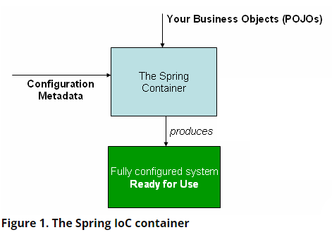
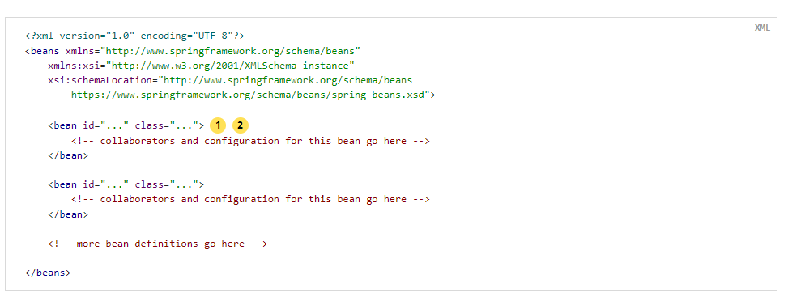

# 核心技术
本部分覆盖了Spring Framework不可或缺的所有技术。

其中最重要的是控制反转（IoC）容器。在对IoC容器彻底讲解后，将对面向切面编程技术（AOP）进行全面的讲解。Spring有它自己的AOP框架。它在概念上是容易理解的，可以满足Java企业编程中80%的AOP需求。

也会对Spring与AspectJ的集成进行讲解。AspectJ是Java领域中功能最丰富，也是最成熟的AOP实现。
## 1. IoC容器
本章讲解Spring的控制反转（IoC）容器。
### 1.1 IoC容器和Bean
本章讲解Spring控制反转的实现。控制反转也可以称为依赖注入（DI）.它是对象仅通过构造器参数，工厂方法参数或通过设置对象实例（通过构造器或工厂方法返回的）的属性来定义依赖（使用的其他对象）的过程。容器创建bean的时候注入它们的依赖。这是bean通过使用类构造器或者如服务定位模式这样机制自己控制依赖的实例化或位置的逆过程（因此称作控制反转）。

org.spring.framework.beans和org.springframework.context包是Spring IoC容器的基础。BeanFactory接口提供了能够管理任意类型对象的高级配置机制。ApplicationContext是BeanFactory的子接口。它增加了如下功能：
* 更容易与Spring AOP整合
* 消息资源处理（用于国际化）
* 事件发布
* 应用层特定的上下文，如用于Web应用的WebApplicationContext

简而言之，BeanFactory提供配置框架和基础的功能，ApplicationContext增加了更多特定的功能。ApplicationContext是BeanFactory的超集。在本章中，ApplicationContext专门用于描述Spring IoC容器。

在Spring中，形成应用程序骨架并由IoC容器管理的对象称为bean。bean是由Spring IoC容器实例化，装配，管理的对象，否则，它就只是应用程序中普通的对象之一。bean以及它们之间的依赖关系反映在容器使用的配置元数据中。
### 1.2 容器概述
org.springframework.context.ApplicationContext接口代表了IoC容器，它负责bean的实例化，配置和装配。容器通过读取配置元数据获得关于哪些对象需要实例化，配置和装配的信息。配置元数据可以用XML，Java注解或者Java代码的方式来表示。它使你能够说明组成应用程序的对象以及这些对象之间丰富的依赖关系。

Spring提供了ApplicationContext接口的几个实现。在独立的应用程序中，通常创建ClassPathXmlApplicationContext或者FileSystemXmlApplicationContext的实例。虽然XML是定义配置元数据的传统格式，但你也可以指示容器使用Java注解或者代码作为元数据格式，方法是提供一小段XML配置来声明式得开启对这些附加的元数据格式的支持。

在大多数应用场景中，实例化Spring IoC容器的一个或多个实例不需要显式的代码。例如在web应用场景中，一个关于应用的八行左右的样版XML文件（web.xml）通常就足够了。如果你使用Spring Tools for Eclipse，只需要点几下鼠标和键盘就可以轻松创建好这个样版配置。

下面的这个图展示了Spring是如何工作的。应用程序类和配置元数据相结合，在ApplicationContext创建和初始化后，你就获得了一个完全配置好的可以运行的系统或应用程序。


#### 1.2.1 配置元数据
如上图所示，Spring IoC容器需要配置元数据。配置元数据是你作为应用开发人员告诉Spring容器如何实例化，配置和装配应用程序中的对象。

配置元数据传统上以简单直观的XML格式提供。本章大部分使用这种格式来讲解Spring IoC容器的关键概念和特征。

> 基于XML的元数据并不是唯一允许的配置元数据格式。Spring IoC容器本身完全与配置元数据编写的格式解耦。现在，许多开发者在他们的Spring应用中选择基于Java代码的配置方式。

在Spring容器中使用其他元数据格式：
* 基于注解的配置：Spring 2.5 开始支持基于注解的配置元数据。
* 基于Java代码的配置：从Spring 3.0 开始，Spring JavaConfig项目提供的许多特性成为核心Spring的一部分。因此，你可以通过Java代码而不是XML文件来定义应用程序类之外的bean。要使用这些特性，可以了解@Configuration，@Bean，@Import和@DependsOn注解。

Spring配置包含至少，通常超过一个容器管理的bean定义。基于XML的配置元数据通过在<beans />元素里使用<bean />元素来配置bean。基于Java代码的配置元数据通常是在@Configuration注解的类中使用@Bean注解的方法来配置bean。

这些bean定义与组成应用程序的实际对象相对应。通常情况下，你会定义服务层对象，数据访问对象（DAOs），持久化对象如Struts的Action实例，基础设置对象如Hibernate的SessionFactories，JMS的Queue等等。通常不会在容器中配置细粒度的域对象，因为创建和加载域对象通常是DAOs和业务逻辑的责任。然而你可以使用Spring与AspectJ整合来配置在IoC容器之外创建的bean。

下面的例子展示了基于XML的配置元数据的基本结构：


> ① id属性是用来唯一标识bean定义的字符串
> ② class属性定义了bean的类型，使用全限定类名

id属性的值用来引用协作对象。XML中引用协作对象没有在这个例子中展示。

#### 1.2.2 实例化容器
提供给ApplicationContext构造器的参数是一个或多个资源路径的字符串，它使容器能够从各种各样的外部资源中加载配置元数据，例如本地文件系统，Java类路径等等。

```java
    ApplicationContext context = new ClassPathXmlApplicationContext("services.xml","daos.xml");
```
> 