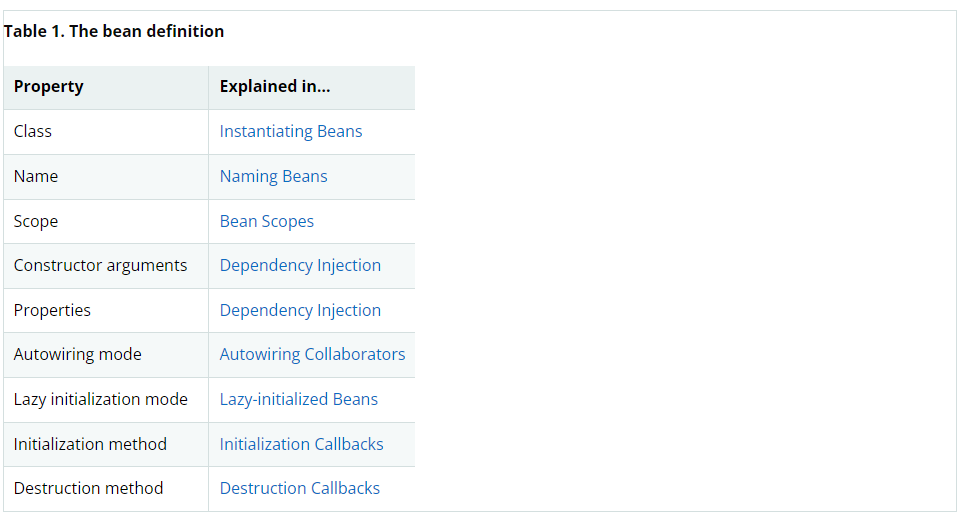
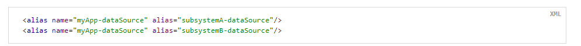

# 核心技术
本部分覆盖了Spring Framework不可或缺的所有技术。

其中最重要的是控制反转（IoC）容器。在对IoC容器彻底讲解后，将对面向切面编程技术（AOP）进行全面的讲解。Spring有它自己的AOP框架。它在概念上是容易理解的，可以满足Java企业编程中80%的AOP需求。

也会对Spring与AspectJ的集成进行讲解。AspectJ是Java领域中功能最丰富，也是最成熟的AOP实现。
## 1. IoC容器
本章讲解Spring的控制反转（IoC）容器。
### 1.1 IoC容器和Bean
本章讲解Spring控制反转的实现。控制反转也可以称为依赖注入（DI）.它是对象仅通过构造器参数，工厂方法参数或通过设置对象实例（通过构造器或工厂方法返回的）的属性来定义依赖（使用的其他对象）的过程。容器创建bean的时候注入它们的依赖。这是bean通过使用类构造器或者如服务定位模式这样机制自己控制依赖的实例化或位置的逆过程（因此称作控制反转）。

org.spring.framework.beans和org.springframework.context包是Spring IoC容器的基础。BeanFactory接口提供了能够管理任意类型对象的高级配置机制。ApplicationContext是BeanFactory的子接口。它增加了如下功能：
* 更容易与Spring AOP整合
* 消息资源处理（用于国际化）
* 事件发布
* 应用层特定的上下文，如用于Web应用的WebApplicationContext

简而言之，BeanFactory提供配置框架和基础的功能，ApplicationContext增加了更多特定的功能。ApplicationContext是BeanFactory的超集。在本章中，ApplicationContext专门用于描述Spring IoC容器。

在Spring中，形成应用程序骨架并由IoC容器管理的对象称为bean。bean是由Spring IoC容器实例化，装配，管理的对象，否则，它就只是应用程序中普通的对象之一。bean以及它们之间的依赖关系反映在容器使用的配置元数据中。
### 1.2 容器概述
org.springframework.context.ApplicationContext接口代表了IoC容器，它负责bean的实例化，配置和装配。容器通过读取配置元数据获得关于哪些对象需要实例化，配置和装配的信息。配置元数据可以用XML，Java注解或者Java代码的方式来表示。它使你能够说明组成应用程序的对象以及这些对象之间丰富的依赖关系。

Spring提供了ApplicationContext接口的几个实现。在独立的应用程序中，通常创建ClassPathXmlApplicationContext或者FileSystemXmlApplicationContext的实例。虽然XML是定义配置元数据的传统格式，但你也可以指示容器使用Java注解或者代码作为元数据格式，方法是提供一小段XML配置来声明式得开启对这些附加的元数据格式的支持。

在大多数应用场景中，实例化Spring IoC容器的一个或多个实例不需要显式的代码。例如在web应用场景中，一个关于应用的八行左右的样版XML文件（web.xml）通常就足够了。如果你使用Spring Tools for Eclipse，只需要点几下鼠标和键盘就可以轻松创建好这个样版配置。

下面的这个图展示了Spring是如何工作的。应用程序类和配置元数据相结合，在ApplicationContext创建和初始化后，你就获得了一个完全配置好的可以运行的系统或应用程序。


#### 1.2.1 配置元数据
如上图所示，Spring IoC容器需要配置元数据。配置元数据是你作为应用开发人员告诉Spring容器如何实例化，配置和装配应用程序中的对象。

配置元数据传统上以简单直观的XML格式提供。本章大部分使用这种格式来讲解Spring IoC容器的关键概念和特征。

> 基于XML的元数据并不是唯一允许的配置元数据格式。Spring IoC容器本身完全与配置元数据编写的格式解耦。现在，许多开发者在他们的Spring应用中选择基于Java代码的配置方式。

在Spring容器中使用其他元数据格式：
* 基于注解的配置：Spring 2.5 开始支持基于注解的配置元数据。
* 基于Java代码的配置：从Spring 3.0 开始，Spring JavaConfig项目提供的许多特性成为核心Spring的一部分。因此，你可以通过Java代码而不是XML文件来定义应用程序类之外的bean。要使用这些特性，可以了解@Configuration，@Bean，@Import和@DependsOn注解。

Spring配置包含至少，通常超过一个容器管理的bean定义。基于XML的配置元数据通过在&lt;beans /&gt;元素里使用&lt;bean /&gt;元素来配置bean。基于Java代码的配置元数据通常是在@Configuration注解的类中使用@Bean注解的方法来配置bean。

这些bean定义与组成应用程序的实际对象相对应。通常情况下，你会定义服务层对象，数据访问对象（DAOs），持久化对象如Struts的Action实例，基础设置对象如Hibernate的SessionFactories，JMS的Queue等等。通常不会在容器中配置细粒度的域对象，因为创建和加载域对象通常是DAOs和业务逻辑的责任。然而你可以使用Spring与AspectJ整合来配置在IoC容器之外创建的bean。

下面的例子展示了基于XML的配置元数据的基本结构：


> ① id属性是用来唯一标识bean定义的字符串
> ② class属性定义了bean的类型，使用全限定类名

id属性的值用来引用协作对象。XML中引用协作对象没有在这个例子中展示。

#### 1.2.2 实例化容器
提供给ApplicationContext构造器的参数是一个或多个资源路径的字符串，它使容器能够从各种各样的外部资源中加载配置元数据，例如本地文件系统，Java类路径等等。

```java
    ApplicationContext context = new ClassPathXmlApplicationContext("services.xml","daos.xml");
```
> 在你了解了Spring IoC容器之后，你可能想要知道更多关于Spring资源抽象的内容。Spring资源抽象提供了从URI语法中定义的路径读取InputStream的方便机制。特别是资源路径用于构造应用程序上下文。

下面的例子展示了服务层对象（services.xml）的配置文件：


下面的例子展示了数据访问对象（daos.xml）的配置文件：


在上面的例子里，服务层对象由PetStoreServiceImpl类和两个数据访问对象构成。这两个数据访问对象是JpaAccountDao和JpaItemDao类型（基于JPA对象关系映射）的。name属性指向JavaBean的属性名。ref属性指向另一个bean定义的名字。id与ref元素之间的连接表达了协作对象之间的依赖关系。

##### 组合基于XML的配置元数据
将bean定义分散在多个XML文件中是有用的。通常，一个XML配置文件代表架构中的一个逻辑层或者一个模块。

你可以使用ApplicationContex的构造器从所有这些XML文件中加载bean定义。正如我们上节看到的，这个构造器接受多个资源路径作为参数。或者使用一个或多个&lt;import /&gt;元素从其他的文件中加载bean定义。下面的这个例子展示了该如何去做：


在上面的例子中，外部的bean定义是从services.xml，messageSource.xml和themeSource.xml三个文件中加载的。这个路径是相对于做导入操作的这个文件。所以services.xml必须是和做导入操作的文件在一个目录下或者是在一个类路径下，而messageSource.xml和themeSource.xml则是在做导入操作的文件路径下的resources路径中。正如你所看到的，开头的斜杠是被忽略的。但是考虑到这个路径是相对的，最好还是不要使用斜杠。根据Spring规范，被导入的文件内容必须包含顶级&lt;beans /&gt;元素，必须是有效的XML bean定义。

> 使用相对路径“../”可以引用父级目录中的文件，这是可以的，但是并不推荐这样做。这样做可能会对当前应用外的文件产生依赖。特别是不建议将这种路径用于类路径（例如classpath:../services.xml）。Spring在解析时会选择“最近的”类路径根，然后查看其父目录。类路径配置的更改可能会导致选择到不同的、不正确的目录。
> 你也可以使用绝对路径代替相对路径：如“file:C:/config/services.xml”或者“classpath:/config/services.xml”。但是注意你正在将应用程序的配置与特定的绝对路径相耦合。通常，最好为此类绝对路径保留一个间接获取-例如通过运行时根据JVM系统属性解析的“${}”占位符。

命名空间本身提供了导入指令的功能。Spring提供的一系列XML命名空间中提供了普通bean定义之外的更多配置功能-例如context和util命名空间。

#### 1.2.3 使用容器
ApplicationContext是能够管理不同bean和依赖关系的高级工厂接口。通过使用 T getBean(String name,Class&lt;T&gt; requiredType)方法可以获取bean的实例。

ApplicationContext让你可以读取bean定义和获取bean。如下面所示：

对于Groovy配置，程序看起来也很相似。它有一个不同的上下文实现类，它支持Groovy（但是也可以理解XML bean定义）。下面展示了Groovy配置：

最灵活的变体是GenericApplicationContext结合读者委托器-例如对于XML文件使用XmlBeanDefinitionReader，如下所示：

你也可以使用GroovyBeanDefinitionReader来读取Groovy文件，如下所示：

你可以在同一个ApplicationContext上混合匹配这样的读者委托器来从不同的配置源读取bean定义。

你可以使用getBean来获取bean的实例。ApplicationContext有一些获取bean的方法，但在应用代码中最好不要使用它们。实际上，你的应用代码最好不要调用getBean()，这样就不会依赖于Spring的API。例如，Spring和web框架的整合为各种web框架容器（如控制器和JSF管理的bean）提供了依赖注入，允许你通过元数据声明对特定bean的依赖（例如通过自动注入注解）。

### 1.3 Bean概述
Spring IoC容器管理一个或多个bean。这些bean是根据你提供给容器的配置元数据（例如XML格式中&lt;beans /&gt;定义）创建的。

对于容器本身，这些bean定义被表示成BeanDefinition对象。它包括了下面这些信息：
* 全限定类名：通常是被定义的实际实现类型
* bean行为配置元素，说明了bean在容器中的行为（作用域，生命周期回调等）
* 协作bean的引用。这些引用被成为协作对象或者依赖
* 在新创建的对象中设置的其他配置设置-如池的大小限制或管理连接池的bean中使用的连接数。

这些元数据转换成组成bean定义的一系列属性。如下所示：


除了bean定义（包含了如何创建特定bean的信息），ApplicationContext的实现还允许注册在容器外（由用户）创建的已经存在的对象。这是通过调用ApplicationContext的getBeanFactory()方法获得BeanFactory，它将返回DefaultListableBeanFactory实现。DefaultListableBeanFactory支持通过registerSingleton(..)和registerBeanDefinition(..)方法来进行注册。然而，常规的应用程序只使用通过常规bean定义元数据创建的bean。

> bean元数据和手工提供的单例实例需要尽早的注册，以便容器在自动注入和其他自省步骤中能够正确推理它们。虽然Spring在某种程度上支持覆盖已经存在的元数据和已经存在的单例实例，但是在运行时注册新的bean是不被官方支持的，可能会导致并发访问异常，bean容器中状态不一致或者两者皆有。

#### 1.3.1 bean命名
每一个bean都有一个或多个标识。这些标识必须是唯一的，在容器中可以根据这个标识定位到bean。bean可以只有一个标识。然而，如果需要不止一个标识，那么额外的标识可以考虑使用别名。

在基于XML的配置元数据中，你可以使用id属性，name属性或者两个都使用来指定bean的标识。id属性让你可以精确的指定一个id。按照惯例，这个标识由字母和数字组成（‘myBean’，‘someService’等），但是也可以包含特殊字符。如果你想为bean设置其他的别名，你可以通过那么属性来指定。每个别名之间用逗号（,）或者分号（;）或者空格分隔。作为对Spring历史的补充，在Spring 3.1之前，id属性被定义成xsd:id类型，它限制了可能的字符。从3.1开始，它被定义成xsd:string类型。请注意，bean id的唯一性由容器强制执行而不是XML解析器。

你不一定需要给bean提供name和id。如果你没有显示提供name和id，容器会为bean生成一个唯一的名称。然而如果你想通过ref元素或者Service Locator式的查找根据名称引用bean，就必须提供名称。不提供名称的动机与使用内部bean和自动注入依赖有关。

> bean命名规范
> 这个规范就是当为bean命名时，使用标准的Java实例属性名称规范。就是说首字母小写，然后开始驼峰命名。例如accountManager，accountService，userDao，loginController等等。
> 一致的命名让你的配置易读易理解。如果你使用Spring AOP，在将advice按名称应用到一系列bean上时会很有用。

> 在类路径下进行组件扫描时，Spring会为没有命名的组件生成bean名称，生成规则遵循前面描述过的：本质上就是采用简单类名，然后把首字母改成小写。然而，在一些特殊（不常见）情况下，当有多个字符，并且第一和第二个字符都是大写的时候，原始的大小写被保留下来。这些与在java.beans.Introspector.decapitalize（Spring使用的）中定义的是相同的规则。

##### 在bean定义外为bean起别名
在bean定义中，你可以通过最多指定一个名称的id属性和可以指定任意数量名称的name属性的结合来为bean提供多个名称。这些名称对同一bean来说是等价的别名，在某些情况下非常有用。例如让应用中的每一个组件通过各自特定的名称来引用一个公共的依赖。

然而，在bean实际定义的地方指定所有别名并不总是足够的，有时需要为在别处定义的bean引入别名。这在大型系统中是常见的，配置文件分散在每个子系统中，每个子系统有着自己的一系列对象定义。在基于XML的配置元数据中，你可以使用&lt;alias /&gt;元素来做到。下面的例子展示了如何做：


在这个例子中，名为fromNamed（相同容器中）的bean在使用了这个别名定义后，也可以通过toNamed引用。

例如，子系统A的配置元数据引用了名为subsystemA-dataSource的数据源，子系统B的配置元数据引用了名为subsystemB-dataSource的数据源。当使用这两个子系统组成主应用程序时，主应用程序通过名称myApp-dataSource来引用数据源。为了让这三个名字都指向相同的对象，你可以在配置元数据中增加如下的别名定义：

现在，每个组件和主应用程序都可以通过各自不同的名称引用到数据源，可以保证不会与其他定义相冲突（高效得创建名称空间），但他们引用的是同一个bean。

> 如果你使用基于Java代码的配置，可以使用@Bean注解来提供别名。

#### 1.3.2 实例化bean